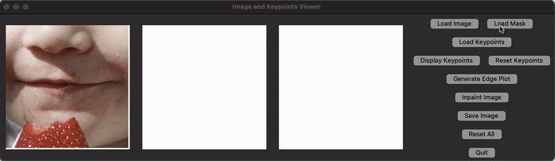

# CleftLipGAN  Inpainting
Official repository of the paper "CleftLipGAN : Interactive GAN-Inpainting for Post-Operative Cleft Lip Reconstruction" submitted to the Workshop on Generative AI for Synthetic Medical Data at ACCV 2024.

<p class="lead"> <b>Abstract:</b> Synthetic generation of post-surgical outcomes holds significant value in the clinical domain, particularly for Cleft lip and palate surgery. These generated images can be utilized for surgical planning, serve as ideal reference images to evaluate surgical success, and assist in educating patients about potential outcomes. Image inpainting is effective for selectively generating Cleft-affected regions, making it a promising technique for this task. Due to the lack of publicly available Cleft-specific datasets, Cleft inpainting models are typically trained on healthy data and applied to Cleft conditions to generate normal lip appearances. However, existing methods often struggle to capture the complexities of Cleft deformities, leading to implausible outcomes that fail to reflect the unique structural characteristics of Cleft-affected regions. To address this, we propose a Structural Guided Pluralistic Inpainting model, trained on healthy images, which allows for real-time, interactive adjustments to synthesize Cleft-specific images. We demonstrate the model’s effectiveness by generating images that closely resemble Cleft conditions and benchmarking it against existing methods. Additionally, we provide a user-friendly interface designed as a tool for post-surgical visualization of Cleft conditions. </p>


## Demo


## Installation

#### Clone this repository
```
https://github.com/AnonymousAccvSubmission/CleftLipGAN_submission.git
cd CleftLipGAN_submission
```

#### Create a conda environment based on yml file
```
conda create -n cleft_inpainting python=3.9
conda activate cleft_inpainting
pip install -r requirements.txt
```
#### Download pre-trained models

The pretrained models are available for download at the following Google Drive location:

[Download Pretrained Models](https://drive.google.com/file/d/1kwUf87zQukqh1jtqTuwtA0BXD8tI5NN2/view?usp=sharing)

After downloading the models, please place them in the `./Inpainting/pretrained` directory.


## Inference with our pre-trained model for lip generation

```
cd CleftLipGAN_submission
python Cleft_UI.py
```

## Training your model 

You can train the inpainting model using your own dataset by specifying the input data paths and hyperparameters in the configuration file.

```
cd CleftLipGAN_submission/Inpainting 
python train.py --cfg ./configs/cleft_inpaintingV3.yaml
```
